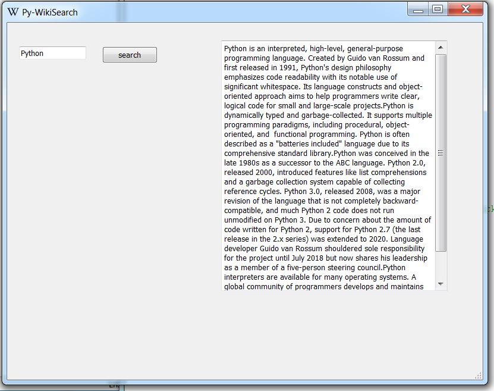

# Py-Wiki-Search
Simple &amp; lightweight Wikipedia search client. Using Python 3.6, PyQt5 GUI library and Wikipedias basic API for python.
</img>
</img>

# Requirements 
PyQt5 (pip install PyQt5)
 
Wikipedia API (pip install wikipedia)
